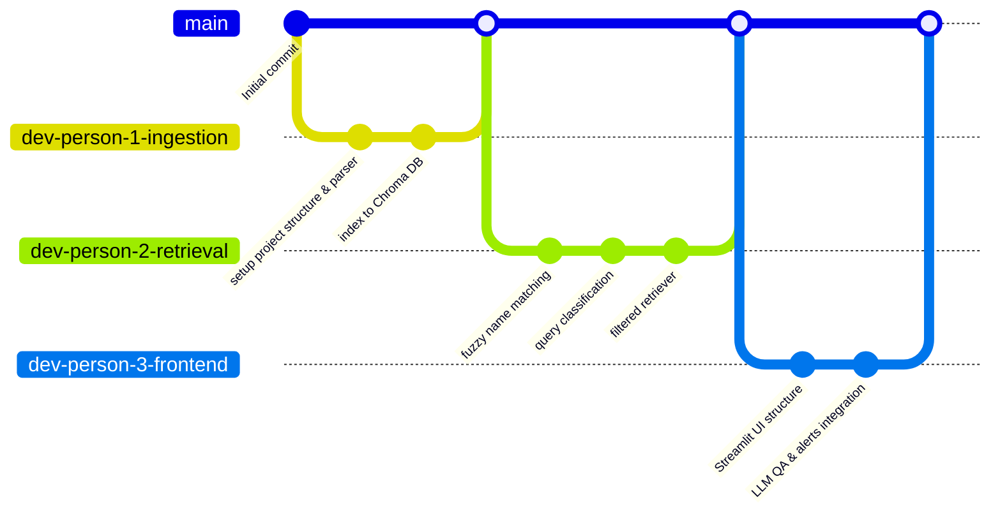

# Implementation Plan - Resume RAG LLM

This project implements a Retrieval-Augmented Generation (RAG) system over a directory of 29 resumes. The system is designed to answer detailed questions about **individual** candidates, handle spelling variations/shortforms of candidate names, and strictly reject queries that attempt to compare, list, or shortlist multiple candidates.

---

## Technical Stack & Configuration

Based on our design alignment, we will use the following tech stack:

1. **Frontend / Application Shell:** [Streamlit](https://streamlit.io/) (Python-based interactive dashboard).
2. **Orchestration Framework:** [LlamaIndex](https://www.llamaindex.ai/) (managing ingestion, Chroma vector store integration, and query engines).
3. **LLM & Embeddings:** 
   - **LLM:** `qwen/qwen-3-8b-instruct` (via OpenRouter API, configured in LlamaIndex).
   - **Embeddings:** `qwen/qwen-3-embedding` (via OpenRouter API, configured in LlamaIndex).
   - **Configuration:** OpenRouter API Key configured via `.env` file (`OPENROUTER_API_KEY`).
4. **Vector Database:** [Chroma DB](https://github.com/chroma-core/chroma) (local file-based vector database integrated with LlamaIndex).
5. **Resume Parsers:** `pypdf` for PDFs and `python-docx` for `.docx` files.
6. **Name Extraction:** Extracted directly from resume filenames (e.g., `ASHOK_Reddy_RESUME - M Ashok reddy.pdf` -> `M Ashok reddy`).
7. **Chunking Strategy:** **Large-Chunk / Whole-Document Strategy** (Treating each resume as a single large document/node of ~2048 tokens).

---

## Team Division & Git Branching Strategy

To simulate a 3-person team, we divide the project into three distinct phases/branches. We will develop each branch sequentially, make granular commits, and merge them into `main` at the end.

---

## Detailed Task Breakdown

### Person 1: Environment, Ingestion & Vector Storage
*   **Branch:** `dev-person-1-ingestion`
*   **Objective:** Set up the workspace, configure dependencies, parse resumes, extract candidate names, and store embeddings in Chroma DB.
*   **Deliverables:**
    1. `requirements.txt`: Project dependencies.
    2. `.env.template`: API key configuration template.
    3. `src/config.py`: Configuration loader for OpenRouter and Chroma paths.
    4. `src/parser.py`: PDF/DOCX parser, name extraction helper.
    5. `src/indexer.py`: Script to build/refresh Chroma DB vector index using LlamaIndex and Qwen3 embeddings.
*   **Git Commits:**
    - `feat: setup dependencies, configuration, and parsers`
    - `feat: implement Chroma DB indexer with Qwen3 embeddings`

---

### Person 2: Fuzzy Name Matching & Query Routing
*   **Branch:** `dev-person-2-retrieval`
*   **Objective:** Implement name parsing from search queries, spelling/shortform correction, and classifier to block multi-resume queries.
*   **Deliverables:**
    1. `src/matcher.py`: Fuzzy name matcher (mapping queries to canonical resume names, identifying spelling mistakes, e.g., "pawan" -> "pavan").
    2. `src/classifier.py`: LLM-based query classifier (distinguishes single-candidate questions from comparison/aggregation questions).
    3. `src/retriever.py`: Integrates fuzzy filter and metadata filters into LlamaIndex query routing.
*   **Git Commits:**
    - `feat: implement fuzzy name resolution with spelling suggestions`
    - `feat: implement LLM-based query classifier (single vs multi-resume)`
    - `feat: implement filtered retrieval query engine`

---

### Person 3: LLM QA Integration & Streamlit Interface
*   **Branch:** `dev-person-3-frontend`
*   **Objective:** Assemble the frontend UI, handle API responses, present spelling-correction alerts, and show chat history.
*   **Deliverables:**
    1. `app.py`: Streamlit main dashboard application.
    2. `tests/test_rag.py`: RAG pipeline validation tests.
    3. `README.md`: Documentation on setup and usage.
*   **Git Commits:**
    - `feat: design main Streamlit layout and session state`
    - `feat: integrate chat window, alerts, and LlamaIndex QA engine`
    - `test: add end-to-end RAG validation tests`

---

## Verification Plan

### Automated Tests (`tests/test_rag.py`)
- Test case 1: Verify correct name parsing from file names.
- Test case 2: Verify fuzzy correction (e.g., inputting "trinadh" or "pawan" maps to correct candidate).
- Test case 3: Verify comparison/aggregation questions are blocked.
- Test case 4: Verify single-candidate QA retrieves correct content.

### Manual Verification
- Run Streamlit: `streamlit run app.py`
- Test layout responsiveness, color aesthetics, and query flows.
